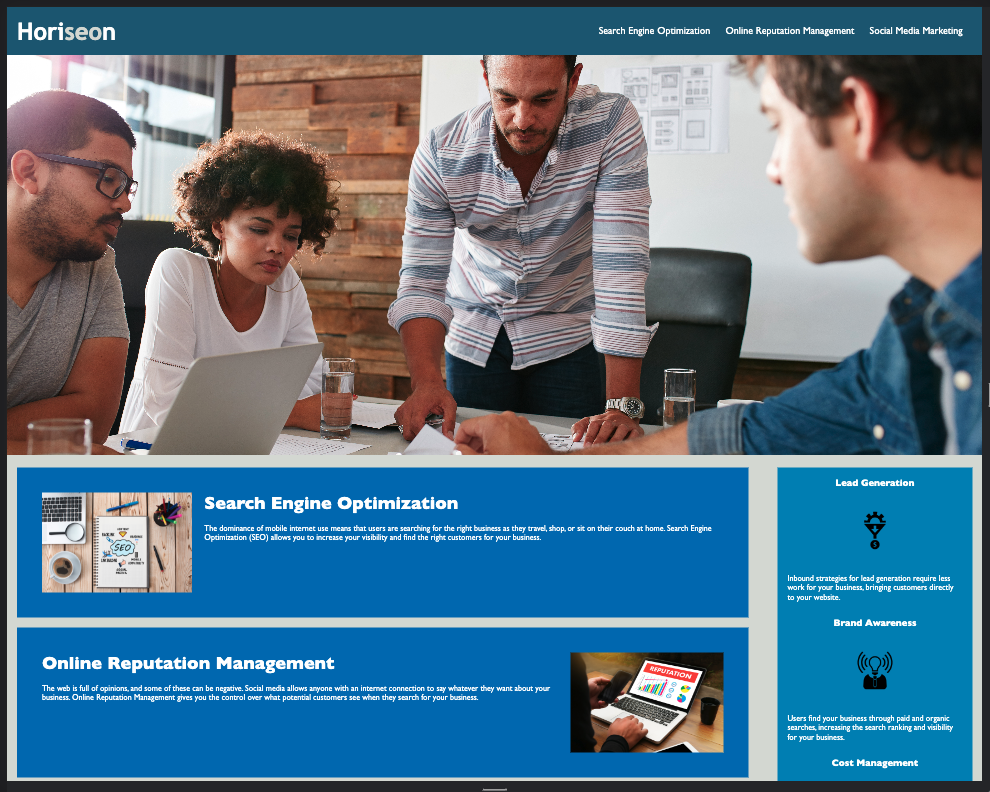
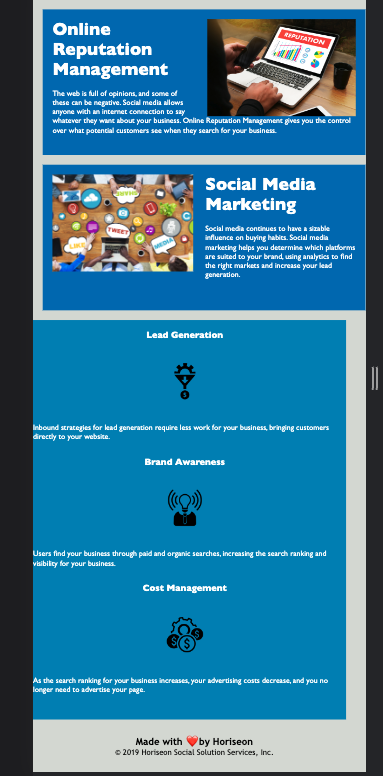

# Marketing Agency Webpage Accessibility

Refactored HTML and CSS code to meet modern accessibility standards.

## Description

- This code refactor uses HTML semantic elements to delineate sections on the marketing webpage to meet modern accessibility standards.
- This ensures that people with disabilities can still access the content of the website using assistive technologies.
- Users will be able to use video captions, screen readers, braille keyboards and other assistive techonlogies to access this site.
- Semantic HTML is the cornerstone of sustainability for a website.

## Installation

If you are running this from VS Code, please view the index.html in your live server.

## Deployed Site

Link to deployed site:
[https://ckc2007.github.io/Marketing-Agency-Webpage-Accessibility/]

Image of desktop site:

Image of mobile site:

## Contributing

Tutorials used in this project include:
https://www.w3.org/WAI/standards-guidelines/

## License

This project is licensed under the MIT license.

## Features

Semantic html and css

## Questions

Please direct questions to the owner of this repository at ckc2007@gmail.com

Owner GitHub page:
[ckc2007](https://github.com/ckc2007).

## Credits

This README was created using the README generator app by ckc2007!
visit the GitHub page to try it out:
[README Generator app by ckc2007](https://github.com/ckc2007/README-Generator)
